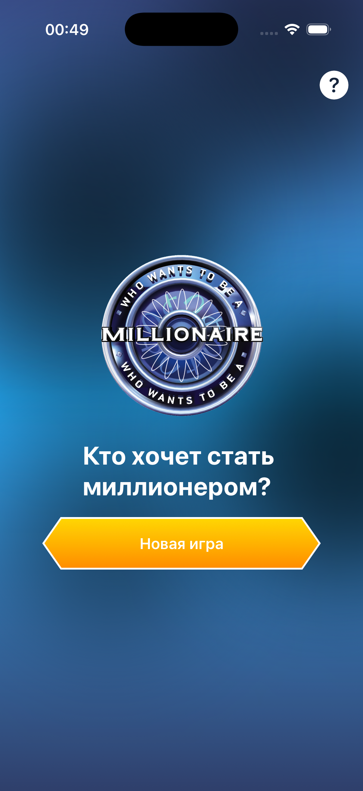
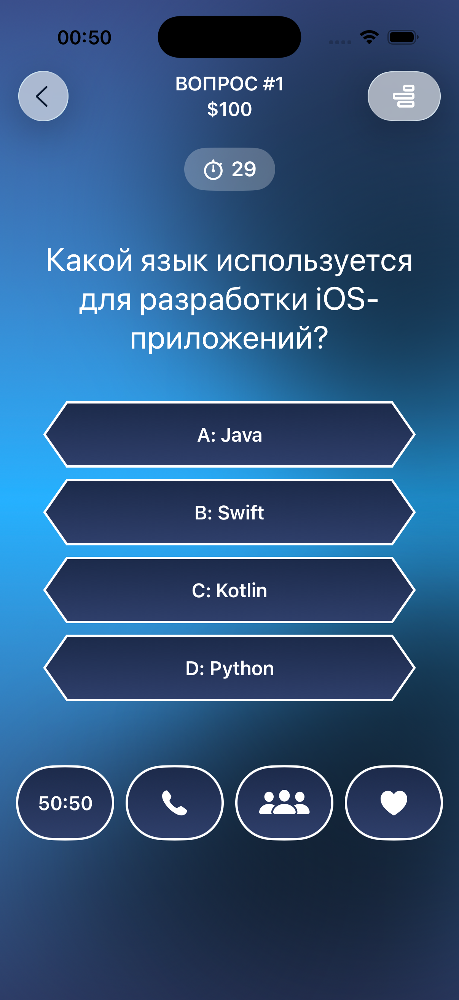
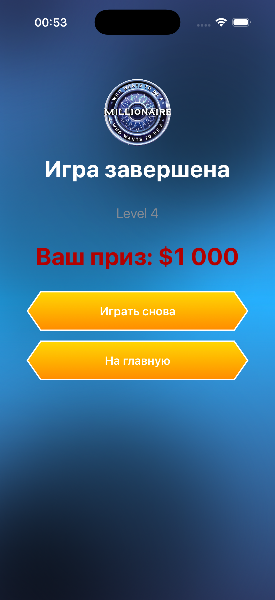

# Millionaire iOS App

## Описание
Приложение‑викторина для iOS, основанное на формате «Кто хочет стать миллионером?».
Игрок отвечает на вопросы с четырьмя вариантами ответа, может использовать подсказки и стремится выиграть главный приз.

## Функциональность
- Экран главного меню:
  - Логотип и название игры.
  - Кнопка **Продолжить игру** (жёлтая, если есть сохранение).
  - Кнопка **Новая игра** (синяя, если есть сохранение; жёлтая, если сохранения нет).
- Основной экран игры:
  - Вопрос и четыре варианта ответа.
  - Таймер на 30 секунд.
  - Подсказки: 50:50, звонок другу, помощь зала, вторая попытка.
  - Подсказка «50:50» делает два варианта серыми и недоступными.
  - «Вторая попытка» сбрасывает таймер и даёт шанс выбрать заново.
- Экран результатов с отображением выигрыша и статуса игры.
- Сохранение прогресса через `PersistenceService`.

## Технологии
- SwiftUI
- Combine
- Кастомные UI‑компоненты:
  - `BrandButton` — стрелочные кнопки с градиентами.
  - `OvalHintButton` — овальные кнопки подсказок.
  - `AnswerButtonView` — кнопки ответов с динамическим цветом.
- Градиенты и кастомные формы для стилизации интерфейса.

## Структура проекта
- `HomeView.swift` — главный экран.
- `GameView.swift` — экран игры.
- `AnswersBlockView.swift` — блок ответов.
- `HintsBlockView.swift` — блок подсказок.
- `ResultView.swift` — экран результатов.
- `AppGradient.swift` — брендовые градиенты.
- `PersistenceService.swift` — сохранение состояния.

## Установка и запуск
1. Открой проект в **Xcode 15+**.
2. Запусти на симуляторе или устройстве с iOS 17+.
3. Начни новую игру или продолжи сохранённую.

## Screenshots
Добавь реальные изображения в папку `docs/` и обнови ссылки ниже:

- Главный экран
  

- Экран игры
  

- Экран результатов
  

## Планы развития
- Добавить анимации переходов.
- Реализовать звуковые эффекты.
- Расширить базу вопросов.
- Локализация на несколько языков.

